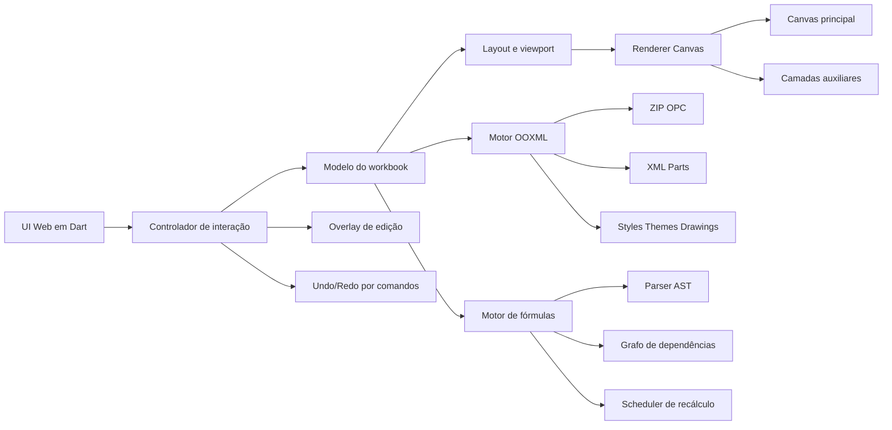
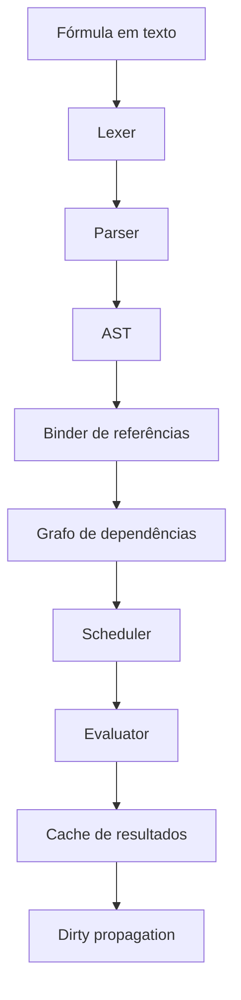
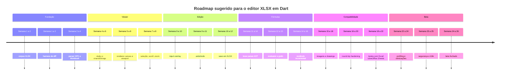

# Soluções open source para editar e renderizar XLSX e plano para um editor em Dart

## Resumo executivo

A conclusão prática é direta: hoje, se o objetivo é **editar e renderizar XLSX com boa fidelidade**, as opções open source mais sólidas são **ONLYOFFICE Docs** para uso web com forte foco em OOXML e renderização via Canvas, **LibreOffice Calc** para desktop e conversão/round-trip amplamente compatível, e **Collabora Online** quando a prioridade é colaboração self-hosted em navegador com base tecnológica do LibreOffice. **Univer** aparece como a opção open source mais interessante para **embedar** experiência de planilha em produto próprio, porque já nasce com **renderização baseada em canvas** e arquitetura de framework; porém, no estado atual do ecossistema oficial, o caminho de importação/exportação `.xlsx` precisa ser verificado com cuidado, porque parte da stack de exchange/import-export aparece associada a plugins/pacotes do ecossistema oficial e nem sempre fica claro, de primeira leitura, quais partes são totalmente abertas em produção. **Gnumeric** continua tecnicamente relevante, mas hoje é menos atraente para workloads OOXML modernos. **Apache OpenOffice Calc** ainda lê `.xlsx`, porém fica claramente atrás em modernidade/fidelidade OOXML. **Luckysheet** foi importante historicamente, mas o próprio projeto declara que **não é mais mantido** e recomenda migração para **Univer**. citeturn16view0turn18search0turn23search1turn23search17turn19view0turn13search6turn10view1turn10view2turn36search1turn38search0turn38search12

Para o seu caso específico de construir um editor **puramente em Dart** no navegador, a pesquisa aponta um caminho claro: a arquitetura mais promissora não é “DOM-first”, e sim **modelo interno OOXML + viewport virtualizada + renderização em canvas + engine de fórmulas incremental**. Isso aproxima seu desenho mais de **Univer**, **ONLYOFFICE** e de grids canvas de alto desempenho do que de soluções DOM tradicionais. Em outras palavras: para ter escala, scroll fluido, controle fino de pintura e boa compatibilidade visual, vale desenhar o produto como um “mini runtime de planilha” em Dart, e não como uma tabela HTML sofisticada. citeturn10view1turn36search7turn38search0turn38search12turn27search3turn28search0

## Panorama dos projetos open source para editar e renderizar XLSX

A tabela abaixo resume os projetos mais relevantes que encontrei com foco em **edição + visualização/renderização** de XLSX. Onde o suporte OOXML é parcial, eu marquei isso explicitamente.

| Projeto | Licença | Linguagem principal | Repositório | Status de manutenção | Edição | Suporte OOXML/XLSX | Renderização via canvas | Observações | Fontes |
|---|---|---|---|---|---|---|---|---|---|
| **LibreOffice Calc** | MPL 2.0 no projeto; contribuições pedidas sob MPLv2/LGPLv3+ | C++ | `LibreOffice/core` | **Muito ativo** | Fórmulas, estilos, formatação, imagens, mesclagem, exportação | **Bom suporte prático** a formatos Microsoft e forte interoperabilidade, embora não seja “OOXML nativo” no sentido de formato interno | **Não** como stack principal de UI do Calc desktop | Excelente base para conversão e validação de compatibilidade | citeturn18search0turn17view0turn10view3turn18search1 |
| **ONLYOFFICE Docs Spreadsheet Editor** | AGPL v3 na Community Edition | JavaScript/Node.js com componentes de servidor e web | `onlyoffice/documentserver` | **Ativo** | Fórmulas, estilos, formatação, imagens, colaboração, exportação | **Muito forte**; o projeto declara compatibilidade plena com OOXML e usa OOXML como base | **Sim, HTML5 Canvas** | A melhor opção OSS quando prioridade é web + fidelidade visual em OOXML | citeturn16view0turn15search5turn15search16turn38search0turn38search12 |
| **Collabora Online Calc** | Predominantemente MPL-2.0 | C++ + JavaScript | `CollaboraOnline/online.mirror` | **Ativo** | Fórmulas complexas, estilos de tabela, edição colaborativa, imagens | **Bom** para ver/editar XLSX/XLS/ODS/CSV | **Sim, equivalente a canvas/tile rendering** no cliente web | Forte alternativa web self-hosted, com herança LibreOffice | citeturn11search11turn11search12turn10view4turn23search1turn23search11turn7search0 |
| **Gnumeric** | GPL | C | `GNOME/gnumeric` | **Ativo, porém menor** | Fórmulas, número/formatação, imagens, gráficos, mesclagem | **Read/Write** para “MS OfficeOpenXML” | **Não** | Muito competente tecnicamente; menos indicado para ecosistema OOXML moderno de alta fidelidade visual | citeturn19view0turn20search0turn20search1 |
| **Apache OpenOffice Calc** | Apache-2.0 | C++ e Java | `apache/openoffice` | **Mantido, mas lento** | Fórmulas, estilos, imagens, edição tradicional | **Parcial**; site oficial destaca leitura de `.xlsx`; o projeto historicamente ficou atrás em escrita OOXML moderna | **Não** | Serve para importação/edição básica, mas eu não o escolheria para round-trip XLSX exigente | citeturn13search0turn13search11turn13search6turn14search2turn14search8 |
| **Univer Sheets** | Apache-2.0 | TypeScript | `dream-num/univer` | **Ativo** | Fórmulas, formatação, data validation, conditional formatting, imagens, rendering extensível | **Sim no ecossistema oficial**, mas import/export XLSX exigem checagem cuidadosa das peças/plugins usados em produção | **Sim, canvas-based** | Melhor candidato OSS para embutir editor de planilha em produto próprio | citeturn10view1turn36search3turn36search7turn36search1turn36search10 |
| **Luckysheet** | MIT | JavaScript | `dream-num/Luckysheet` | **Descontinuado** | Formatação, fórmulas, comentários, imagens, proteção, operações de tabela | **Via Luckyexcel/plugin**; o próprio projeto direciona import/export avançados para Univer | **Sim** | Foi relevante; hoje deve ser tratado como legado | citeturn24view1turn25search1turn26search1turn26search5turn10view2 |

Em termos de recomendação objetiva, eu resumiria assim. Para **uso final de escritório** e validação de compatibilidade: **LibreOffice Calc** e **ONLYOFFICE Docs**. Para **edição colaborativa self-hosted no browser**: **ONLYOFFICE Docs** e **Collabora Online**. Para **construir produto próprio**: **Univer** é a referência open source mais alinhada com a arquitetura que você provavelmente quer reproduzir em Dart. Para **interoperabilidade OOXML mais delicada**, eu trataria **OpenOffice** e **Gnumeric** como ferramentas auxiliares, não como base estratégica principal. citeturn16view0turn23search1turn10view1turn19view0turn13search6

## Google Sheets usa canvas

Aqui existe uma diferença importante entre o que é **evidência direta oficial** e o que é **inferência técnica muito forte**. O Google publicou, de forma explícita e oficial, que **Google Docs** migrou de HTML para **canvas-based rendering** em 2021. Para **Google Sheets**, eu **não encontrei um post oficial igualmente explícito** dizendo, com essas palavras, “Sheets usa canvas para renderização do grid”. citeturn29search20

Mesmo assim, a evidência pública disponível aponta de forma convincente para a conclusão de que **o Google Sheets usa canvas ao menos em partes relevantes do pipeline de renderização visual**. Há três sinais fortes. Primeiro, várias respostas na própria comunidade/ajuda oficial do Google para problemas de exibição em **Google Sheets** mandam desativar **Canvas Rendering** ou **Canvas Color Spaces**, o que indica diretamente que o produto depende dessa trilha de renderização no navegador. Segundo, um bug da Mozilla originalmente sobre problema de fontes no Google Sheets foi retitulado para **“Font Problems rendering fonts to canvas using ctx.fillText”**, ligando o comportamento do Sheets à renderização em canvas. Terceiro, isso é tecnicamente coerente com o padrão arquitetural de apps de produtividade web de altíssima densidade visual, onde o grid é pintado em canvas e algumas camadas interativas ficam em DOM. citeturn30search1turn30search2turn30search5turn30search7turn31search8turn32search11

A resposta mais rigorosa, portanto, é esta: **sim, tudo indica que o Google Sheets usa canvas na renderização do grid e/ou em partes substanciais da superfície visual**, mas **a prova pública oficial disponível é indireta**, e não tão frontal quanto a comunicação oficial do Google sobre o Google Docs. Se você precisar de um texto juridicamente ou academicamente “à prova de contestação”, eu recomendaria formular como: **“há forte evidência pública e técnica de uso de canvas no Google Sheets, embora eu não tenha localizado um anúncio oficial do Google tão explícito quanto o de Google Docs.”** citeturn29search20turn30search1turn32search11

Também vale não confundir isso com o novo recurso chamado **“Sheets canvas”** anunciado em 2026, que é outra coisa: um recurso do produto para criar interfaces e visualizações interativas dentro do Sheets com Gemini. Esse “canvas” é uma **feature de produto**, não a documentação da engine de renderização do grid. citeturn29search10turn29search12

## Bibliotecas e motores que renderizam planilhas via canvas

Abaixo estão as opções mais relevantes para quem quer estudar ou comparar stacks “canvas-first” para planilhas e grids. Misturei aqui **editores completos** e **motores de grid** porque, para o seu plano em Dart, ambos são úteis: os primeiros ensinam arquitetura de produto; os segundos ensinam performance e viewport.

| Projeto | Categoria | Canvas | XLSX | Pontos fortes | Limitações | Fontes |
|---|---|---|---|---|---|---|
| **ONLYOFFICE Docs** | suíte/editor completo | **Sim** | **Muito forte** | WYSIWYG forte, foco em OOXML, colaboração, maturidade | código e build maiores; stack complexa | citeturn38search0turn38search12turn16view0 |
| **Univer** | framework/editor embutível | **Sim** | **Sim no ecossistema oficial** | arquitetura modular, rendering engine, fórmula, custom rendering | import/export pode depender de stack oficial específica | citeturn10view1turn36search1turn36search7turn36search10 |
| **Luckysheet** | editor web legado | **Sim** | **Via Luckyexcel/plugin** | API conhecida, muitos recursos de UX de planilha | descontinuado | citeturn24view1turn25search1turn10view2 |
| **x-spreadsheet** | biblioteca leve de planilha | **Sim** | **Parcial / via integrações** | leve, simples, bom para protótipos | perdas relatadas em xlsx import/export; projeto migrou | citeturn37search1turn37search3turn37search6turn37search9turn37search11 |
| **canvas-datagrid** | grid canvas | **Sim** | **Não é engine XLSX nativa** | milhões de linhas em único canvas, customização alta | não resolve fórmulas, OOXML, estilos de planilha por si só | citeturn28search0turn28search2turn28search5turn28search15 |
| **Glide Data Grid** | grid/data editor canvas | **Sim** | **Não nativo** | viewport extremamente rápida, lazy rendering, scrolling nativo | é grid/editor de dados, não editor OOXML completo | citeturn27search3turn27search10 |
| **Collabora Online** | editor online baseado em tiles | **Equivalente funcional** | **Bom** | colaboração, forte interoperabilidade, self-hosted | não é “canvas library” embutível; arquitetura mais pesada | citeturn7search0turn23search1turn10view4 |

A implicação arquitetural para o seu projeto é importante. Se a meta é um editor XLSX em Dart com bom desempenho, você não precisa copiar exatamente a implementação de uma suíte como o ONLYOFFICE. O que você precisa copiar é o **padrão**: **viewport virtualizada**, **pintura em uma ou poucas superfícies canvas**, **camada de edição em overlay** e **modelo próprio de planilha desacoplado da UI**. Nesse sentido, **Univer** é a referência conceitual mais próxima do que você quer construir em Dart, enquanto **Glide Data Grid** e **canvas-datagrid** ajudam a pensar a parte de desempenho e de renderização incremental. citeturn10view1turn36search7turn27search3turn28search0

## Compatibilidade do arquivo analisado e como testar localmente

Você informou o caminho original `C:\MyDartProjects\xlsx_editor\resources\PGCTIC1_-_PE_-_Planilha_de_Economicidade_-_Gestão_Pública.xlsx`, e eu **não tive acesso remoto a esse caminho Windows**. No entanto, havia uma **cópia do arquivo enviada nesta conversa**, e eu consegui fazer uma inspeção local manual dessa cópia nesta sessão. Nessa inspeção, o arquivo se mostrou um XLSX relativamente “bom” para um MVP de editor: há múltiplas abas, muitas fórmulas, células mescladas e imagens incorporadas. Em um teste local desta sessão, o **LibreOffice** conseguiu **abrir/renderizar o arquivo, exportar para PDF e regravar em XLSX**, preservando a estrutura geral das abas e das fórmulas detectáveis, embora com normalização de alguns formatos/estilos.  

Com base nisso e nos recursos oficiais de cada projeto, a minha estimativa de compatibilidade prática para esse arquivo é:

| Projeto | Probabilidade de abrir e renderizar bem | Probabilidade de permitir edição útil | Risco principal no seu arquivo | Fontes |
|---|---|---|---|---|
| **LibreOffice Calc** | Alta | Alta | pequenas diferenças visuais/numFmt no round-trip | citeturn18search1turn17view0 |
| **ONLYOFFICE Docs** | Alta | Alta | diferenças finas em objetos/imagens ancoradas e edge cases OOXML | citeturn16view0turn15search5turn15search16 |
| **Collabora Online** | Alta | Alta | diferenças de layout e comportamento de objetos gráficos | citeturn23search1turn23search11 |
| **Gnumeric** | Média | Média | menor fidelidade para OOXML moderno e imagens/objetos complexos | citeturn19view0turn20search0 |
| **Apache OpenOffice Calc** | Média para abrir, baixa para round-trip moderno | Média-baixa | suporte OOXML mais fraco, especialmente em escrita moderna | citeturn14search2turn14search8 |
| **Univer** | Média | Média-alta | depende da rota exata de import/export XLSX habilitada no seu setup | citeturn36search1turn36search3 |
| **Luckysheet** | Média-baixa | Média-baixa | projeto legado; import/export via plugins e maior risco de perda | citeturn10view2turn25search1 |

Se você quiser repetir os testes localmente de forma manual, eu faria na ordem abaixo.

### Teste mínimo com LibreOffice

```bash
libreoffice "C:\MyDartProjects\xlsx_editor\resources\PGCTIC1_-_PE_-_Planilha_de_Economicidade_-_Gestão_Pública.xlsx"
```

Checklist manual:

1. confirmar quantidade e nomes das abas;
2. verificar se imagens aparecem;
3. clicar em células com fórmulas-chave e conferir se a fórmula foi lida;
4. editar 3 a 5 células, salvar em novo arquivo `.xlsx`;
5. reabrir o arquivo salvo no Excel/LibreOffice/ONLYOFFICE;
6. exportar também para PDF e conferir se o layout geral está aceitável.

Teste headless útil para CI ou smoke test:

```bash
libreoffice --headless --convert-to pdf ^
  "C:\MyDartProjects\xlsx_editor\resources\PGCTIC1_-_PE_-_Planilha_de_Economicidade_-_Gestão_Pública.xlsx"

libreoffice --headless --convert-to xlsx:"Calc MS Excel 2007 XML" ^
  "C:\MyDartProjects\xlsx_editor\resources\PGCTIC1_-_PE_-_Planilha_de_Economicidade_-_Gestão_Pública.xlsx"
```

### Teste com ONLYOFFICE Docs

A rota mais prática é subir um ambiente local do Document Server e abrir o arquivo por um conector ou por uma integração de teste. O projeto publica instalação por Docker e o editor declara suporte pleno a `.xlsx`, além de edição e exportação web. citeturn16view0turn15search7

Comandos de referência:

```bash
docker run -i -t -d -p 80:80 --restart=always onlyoffice/documentserver
```

Depois, faça o upload do arquivo via integração de teste, abra a planilha e verifique:

- abas;
- fórmulas recalculadas;
- mesclagens;
- imagens;
- salvar novamente em `.xlsx`;
- reabrir o arquivo salvo em LibreOffice e comparar.

### Teste com EtherCalc

Eu **não colocaria EtherCalc como candidato principal** para esse arquivo, mas ele é útil como referência de interoperabilidade e import/export leve. O repositório atual mostra fluxo ativo e menciona import/export XLSX no rewrite, com runbook de execução local. Historicamente, porém, há relatos de problemas de export em cenários específicos, então eu trataria como experimento, não como baseline de compatibilidade. citeturn35search2turn35search11turn35search13turn35search14turn35search5

```bash
git clone https://github.com/audreyt/ethercalc
cd ethercalc
docker compose up -d
```

### Procedimento de diff recomendado para qualquer editor

Independentemente da ferramenta, o melhor teste de compatibilidade não é apenas “abre ou não abre”. É um **round-trip controlado**:

1. abrir o XLSX original;
2. salvar como um novo XLSX;
3. descompactar os dois arquivos (`.xlsx` é ZIP);
4. comparar `xl/workbook.xml`, `xl/worksheets/*.xml`, `xl/styles.xml`, `xl/sharedStrings.xml`, `xl/drawings/*` e `xl/media/*`;
5. aceitar mudanças cosméticas pequenas, mas sinalizar perda de fórmulas, imagens, merges, estilos de número e relações de desenho.

## Plano detalhado para implementar um editor XLSX puramente em Dart

A proposta abaixo assume:

- **Dart SDK `^3.6.0`**;
- uso de **`package:web ^1.1.1`** para APIs do navegador;
- **nenhuma dependência JavaScript externa**;
- core todo em **Dart puro**;
- arquitetura desenhada para evoluir de **viewer compatível** para **editor XLSX robusto**.  

A decisão central do plano é esta: **separe radicalmente o core OOXML, a engine de fórmulas e a renderização**. Essa separação é o que permite desempenho, testabilidade e compatibilidade. A própria estrutura de OOXML e OPC favorece esse desenho, porque `.xlsx` é um pacote ZIP com partes XML e relacionamentos bem definidos. citeturn33search1turn33search2turn33search3turn33search6

### Arquitetura alvo



### Estrutura de pacotes internos

Eu criaria um monorepo com estes módulos:

- `xlsx_core`
  - modelos de workbook, worksheet, row, column, cell, range, style, image, named range, hyperlink, validation;
- `xlsx_ooxml`
  - leitura/escrita de OPC/ZIP, relacionamentos, workbook part, worksheet part, styles, themes, shared strings, drawings, media;
- `xlsx_formula`
  - lexer, parser, AST, evaluator, registry de funções, dependency graph, recalc engine;
- `xlsx_render`
  - cálculo de layout, métricas de células, dirty regions, renderer em canvas, cache de texto e de estilos;
- `xlsx_ui`
  - seleção, navegação, edição in-place, clipboard, fill handle, resize, freeze panes, menus contextuais;
- `xlsx_history`
  - comandos, undo/redo, batching transacional;
- `xlsx_web_app`
  - shell do navegador, input de arquivo, integrações com `package:web`, eventos, persistence local.

Esse desenho é deliberadamente parecido com o que projetos como **Univer** deixam transparecer: rendering engine, formula engine, editor e model separados. A diferença é que, no seu caso, tudo ficaria em Dart. citeturn36search7turn10view1

### Leitura e escrita de XLSX e OOXML

#### Estratégia de parsing

Implemente primeiro o **subset OOXML “transitional”** que aparece na maioria dos arquivos reais produzidos por Excel, LibreOffice e Google Sheets exportado. O pipeline de leitura deve seguir esta ordem:

1. abrir o ZIP;
2. ler `[Content_Types].xml`;
3. resolver `_rels/.rels`;
4. localizar `xl/workbook.xml`;
5. resolver `xl/_rels/workbook.xml.rels`;
6. carregar:
   - worksheets,
   - sharedStrings,
   - styles,
   - theme,
   - drawings,
   - media,
   - defined names,
   - calc settings;
7. montar o modelo interno. citeturn33search2turn33search3turn33search6

#### Partes mínimas para o MVP

No MVP, eu trataria como obrigatórias:

- `xl/workbook.xml`
- `xl/worksheets/sheet*.xml`
- `xl/styles.xml`
- `xl/sharedStrings.xml`
- `xl/theme/theme1.xml`
- `xl/drawings/*.xml`
- `xl/worksheets/_rels/*.rels`
- `docProps/core.xml`
- `docProps/app.xml`

E como opcionais, mas preserváveis no round-trip:

- `calcChain.xml`
- `tables/*.xml`
- `comments*.xml`
- `externalLinks/*`
- `pivot*`
- `vbaProject.bin`  

Se a meta é compatibilidade séria, **não descarte partes desconhecidas**. Preserve-as opacas no pacote e regrave-as, mesmo que o editor não as entenda. Isso é particularmente importante para extensões documentadas pela Microsoft para `.xlsx`. citeturn33search3turn33search4turn33search8

#### Política de round-trip

A regra deve ser:

- **se o usuário não alterou uma área**, prefira reemitir a parte original com o mínimo de normalização;
- **se alterou**, serialize só o necessário;
- preserve:
  - ordens de sheet IDs,
  - defined names,
  - relationships,
  - imagens em `xl/media`,
  - âncoras de desenhos,
  - rich text runs,
  - estilos não usados mas referenciados.

Essa política reduz o risco clássico de um editor “abrir bem” e “salvar pior”.

### Modelo de dados e mapeamento de estilos

#### Modelo interno de célula

Eu usaria uma célula com separação clara entre **valor**, **fórmula**, **formato** e **display**:

```dart
final class CellModel {
  final CellValue? value;          // número, texto, bool, erro, data serial
  final String? formulaA1;         // fórmula canônica interna
  final int? styleId;              // referência para tabela de estilos
  final String? sharedFormulaRef;  // opcional
  final String? richTextId;        // opcional
  final CellMeta meta;             // comentário, hyperlink, flags
  const CellModel({
    this.value,
    this.formulaA1,
    this.styleId,
    this.sharedFormulaRef,
    this.richTextId,
    this.meta = const CellMeta(),
  });
}
```

#### Estilos

O pipeline de estilos precisa mapear:

- fontes;
- fills;
- borders;
- alignment;
- number formats;
- protection;
- theme colors + tint/shade. citeturn33search1turn33search6

A melhor prática aqui é **não renderizar estilos direto do XML**. Faça uma etapa de compilação para um `ResolvedCellStyle` próprio:

```dart
final class ResolvedCellStyle {
  final String fontFamily;
  final double fontSize;
  final bool bold;
  final bool italic;
  final int textColorArgb;
  final int fillColorArgb;
  final BorderStyleSpec borderTop;
  final BorderStyleSpec borderRight;
  final BorderStyleSpec borderBottom;
  final BorderStyleSpec borderLeft;
  final HorizontalAlign hAlign;
  final VerticalAlign vAlign;
  final bool wrapText;
  final int rotation;
  final String numberFormatCode;
  const ResolvedCellStyle(...);
}
```

Isso permite cache, hashing, deduplicação e desenho muito mais rápido.

#### Datas e formatos numéricos

Armazene datas internamente como:

- `double serialValue`;
- `DateSystem excel1900/excel1904`;
- `numberFormatCode`.

A apresentação localizada deve ocorrer só na camada de display. O **valor interno** e o **OOXML persistido** continuam canônicos.

### Fórmulas

#### Minha recomendação estratégica

Para este projeto, eu **não recomendo depender de uma engine externa via JS**. Como o objetivo é ser “puramente Dart”, o melhor caminho é uma **engine própria em Dart**, implementada em fases. A razão é dupla:

- você controla compatibilidade, threading, profiling e empacotamento;
- o seu arquivo-alvo, na inspeção local desta sessão, usa um conjunto de funções relativamente enxuto, dominado por funções condicionais e agregações simples, o que torna o MVP muito mais viável do que seria em uma planilha “financeira extrema”.

#### Fases da engine

**Fase inicial**
- parser A1;
- referências intra-sheet e inter-sheet;
- operadores aritméticos;
- coerção básica de tipos;
- funções:
  - `SUM`
  - `AVERAGE`
  - `MIN`
  - `MAX`
  - `IF`
  - `AND`
  - `OR`
  - `ABS`
  - `ROUND`, `ROUNDUP`, `ROUNDDOWN`
  - `COUNT`, `COUNTA`
  - `LEFT`, `RIGHT`, `MID`, `LEN`
  - `TODAY`, `NOW`
  - `IFERROR`

**Fase intermediária**
- nomes definidos;
- shared formulas;
- array formulas clássicas;
- `SUMIFS`, `COUNTIFS`, `VLOOKUP`, `INDEX`, `MATCH`, `XLOOKUP`;
- detecção de circularidade;
- recálculo incremental.

**Fase avançada**
- dynamic arrays;
- spill behavior;
- funções compatíveis com Google Sheets quando divergirem do Excel;
- iteração configurável para ciclos.

Projetos como **HyperFormula** e **Univer** são boas referências conceituais para escopo, catálogo e arquitetura de engine, mesmo que você não os integre diretamente. O HyperFormula documenta centenas de funções e o Univer enfatiza computation em web worker/server e compatibilidade forte com Excel. citeturn34search0turn34search2turn34search5turn34search20

#### Arquitetura técnica da engine



Implementação recomendada:

- **lexer** com tokens simples;
- **parser Pratt** ou recursive descent;
- **AST imutável**;
- **registry de funções** por assinatura;
- **dependency graph** por célula;
- **dirty propagation** de precedentes para dependentes;
- **memoização** por epoch de recálculo.

### Renderização via canvas

#### Princípios

A renderização deve ser feita em **canvas**, com no máximo um pequeno conjunto de camadas:

- grid base;
- seleção/realces;
- objetos flutuantes;
- overlay de edição DOM ou canvas secundário.

Não tente tornar cada célula um nó DOM. Isso destrói escalabilidade.

#### Layout e viewport

Calcule sempre apenas a janela visível:

- linhas visíveis;
- colunas visíveis;
- headers visíveis;
- frozen panes visíveis;
- objetos e imagens que intersectam o viewport.

Mantenha:

- cumulativos de largura de colunas;
- cumulativos de altura de linhas;
- busca binária por offset scroll;
- dirty rectangles;
- caches por:
  - texto medido,
  - estilo resolvido,
  - runs ricos,
  - bitmaps de imagem.

Os grids canvas de alto desempenho usam exatamente esse tipo de viewport sob demanda. citeturn27search3turn28search0turn28search5

#### Esboço de desenho em Dart com `package:web`

```dart
import 'dart:math' as math;
import 'package:web/web.dart' as web;

void drawGrid(
  web.HTMLCanvasElement canvas,
  List<double> colWidths,
  List<double> rowHeights,
) {
  final ctx = canvas.getContext('2d') as web.CanvasRenderingContext2D;
  final width = canvas.width.toDouble();
  final height = canvas.height.toDouble();

  ctx.clearRect(0, 0, width, height);
  ctx.font = '12px Arial';
  ctx.textBaseline = 'middle';

  double x = 0;
  for (final w in colWidths) {
    ctx.beginPath();
    ctx.moveTo(x + 0.5, 0);
    ctx.lineTo(x + 0.5, height);
    ctx.stroke();
    x += w;
    if (x > width) break;
  }

  double y = 0;
  for (final h in rowHeights) {
    ctx.beginPath();
    ctx.moveTo(0, y + 0.5);
    ctx.lineTo(width, y + 0.5);
    ctx.stroke();
    y += h;
    if (y > height) break;
  }

  // Exemplo de célula A1
  ctx.fillText('A1', 8, math.min(rowHeights.first / 2, height / 2));
}
```

#### Edição in-place

A edição de célula não deve acontecer “dentro” do canvas. O padrão mais robusto é:

- canvas desenha grid;
- ao editar, um `input`/`textarea` é posicionado por cima da célula;
- IME, seleção de texto, atalhos e clipboard ficam melhores;
- ao confirmar, o overlay some e o canvas é redesenhado.

Esse é o padrão mais seguro para acessibilidade, IME e produtividade.

### Edição, undo/redo e UX

Use **Command Pattern** para tudo que muta estado:

- `SetCellValueCommand`
- `SetCellFormulaCommand`
- `SetStyleRangeCommand`
- `InsertRowsCommand`
- `DeleteColumnsCommand`
- `MergeCellsCommand`
- `MoveRangeCommand`
- `ResizeColumnCommand`

Cada comando precisa saber:

- `apply()`
- `revert()`
- `mergeWith(next)` para digitação contínua
- `affectedRanges()`

Undo/redo deve ser **transacional**. Exemplo: colar uma área 20x30 gera **um batch**, não 600 comandos isolados.

### Grandes planilhas, virtualização e paginação

Em planilhas grandes, o que importa é o viewport, não o total. O pipeline recomendado é:

- workbook inteiro no modelo lógico;
- viewport físico parcial;
- cálculo preguiçoso de layout;
- carregamento/adaptação por aba;
- opcionalmente, paginação lógica só para operações muito pesadas de import/export.

O que eu recomendo implementar já no MVP:

- virtualização 2D completa;
- `requestAnimationFrame` para pintura;
- debounce para resize e scroll;
- chunking para parse inicial;
- recálculo incremental;
- cache LRU de métricas de texto.

E no estágio seguinte:

- worker dedicado para parse e/ou fórmulas pesadas;
- raster cache para headers e regiões congeladas;
- thumbnail cache para imagens;
- serialização incremental na gravação.

### Compatibilidade com Excel e Google Sheets

A compatibilidade real depende menos de “abrir o XML” e mais de cinco decisões de arquitetura:

1. **preservar partes desconhecidas**;
2. **não reescrever estilos desnecessariamente**;
3. **manter fórmulas internas canônicas**;
4. **suportar shared strings, rich text e imagens com âncoras**;
5. **ter corpus de regressão** com arquivos gerados por Excel, LibreOffice e Google Sheets. citeturn33search3turn33search4turn33search6turn14search4

Para Google Sheets, eu adicionaria testes específicos para:

- fórmulas exportadas do Sheets para XLSX;
- number formats com localidade;
- validações;
- imagens e desenhos simples;
- merges;
- nomes definidos.

### Segurança

As ameaças principais aqui não são “RCE mágica por abrir XLSX”, e sim:

- **zip bombs**;
- **XML oversized / denial of service**;
- **path traversal em ZIP**;
- **links externos**;
- **macros VBA**;
- **CSV/formula injection** em exportações futuras;
- **arquivos gigantes com imagens comprimidas maliciosamente**.

Políticas recomendadas:

- limitar tamanho total descompactado;
- limitar quantidade de partes;
- bloquear caminhos fora do package esperado;
- não executar macros;
- preservar `vbaProject.bin` apenas como payload opaco, se desejar round-trip;
- desabilitar refresh externo por padrão;
- sanitizar hyperlinks e export CSV.

### Internacionalização e acessibilidade

Internacionalização deve atuar em três camadas diferentes:

- **UI**: rótulos, menus, mensagens;
- **display**: datas, moeda, decimal, separadores;
- **fórmulas**: apresentação localizada opcional, mas persistência canônica OOXML.

Minha recomendação é: **persistir fórmulas em nomes canônicos internos** e oferecer tradução de nomes de função apenas na interface, se for necessário mais tarde. Isso reduz imensamente o risco de incompatibilidade.

Para acessibilidade:

- navegação completa por teclado;
- foco lógico por célula;
- leitura de coordenada e conteúdo por `aria-live` em overlay complementar;
- contraste e high-DPI;
- zoom 80%–200%.

### Esboço de leitura de XLSX em Dart

Como a implementação será sua, o código abaixo é um esboço de como eu estruturaria a API interna:

```dart
import 'dart:typed_data';
import 'package:web/web.dart' as web;

final class Workbook {
  final List<Worksheet> sheets;
  const Workbook(this.sheets);
}

final class Worksheet {
  final String name;
  const Worksheet(this.name);
}

final class XlsxReader {
  Future<Workbook> readBytes(Uint8List bytes) async {
    // TODO:
    // 1. abrir ZIP (OPC)
    // 2. localizar workbook.xml
    // 3. carregar sharedStrings/styles/worksheets
    // 4. construir o modelo interno
    throw UnimplementedError();
  }
}

Future<void> openFromFile(web.File file) async {
  final buffer = await file.arrayBuffer();
  final bytes = Uint8List.view(buffer);
  final workbook = await XlsxReader().readBytes(bytes);
  web.window.console.log('Abas: ${workbook.sheets.map((s) => s.name).toList()}');
}
```

## Roadmap, estimativas e riscos

A estimativa abaixo assume **engenharia sem restrição de orçamento**, mas com uma preocupação realista de escopo. Em dias-homem, eu separaria o projeto em **MVP técnico**, **MVP utilizável** e **beta de compatibilidade**.

### Estimativa por milestone

| Milestone | Entregável | Esforço estimado |
|---|---|---:|
| **Descoberta e corpus** | amostras XLSX, harness de diff, golden files, benchmark inicial | 8–12 dh |
| **Core OOXML mínimo** | leitura de OPC/ZIP, workbook, worksheets, sharedStrings, styles | 15–20 dh |
| **Viewer inicial** | canvas render, scroll, seleção, zoom, freeze panes simples | 18–25 dh |
| **Modelo de edição** | editar célula, input overlay, clipboard básico, undo/redo | 18–24 dh |
| **Escrita de XLSX** | serialização OOXML mínima, save/download, round-trip básico | 20–28 dh |
| **Fórmulas MVP** | parser, AST, evaluator, dependency graph, subset de funções | 25–35 dh |
| **Estilos e imagens** | borders, fills, fonts, merges, drawings/images | 18–30 dh |
| **Performance** | virtualização 2D, caches, profiling, dirty rects, benchmark | 15–22 dh |
| **Compatibilidade e hardening** | corpus Excel/LibreOffice/Sheets, preservação de partes desconhecidas | 20–30 dh |
| **Segurança, i18n e QA final** | limites, testes, acessibilidade, release engineering | 15–20 dh |

**Total realista para um editor utilizável e sério:** **172–246 dias-homem**.  
Com **1 dev**, isso tende a significar algo como **9 a 12 meses**.  
Com **2 devs** competentes e foco fechado, algo como **4 a 6 meses** para um beta muito bom é plausível.  

### Timeline sugerida



### Riscos principais

| Risco | Impacto | Mitigação |
|---|---|---|
| **Compatibilidade OOXML real é mais complexa que o esperado** | Alto | preservar partes desconhecidas; corpus amplo; round-trip diff automatizado |
| **Engine de fórmulas cresce demais** | Alto | escopo por fases; priorizar funções do corpus real; arquitetura por registry |
| **Medição de texto e layout no canvas divergem entre browsers** | Alto | golden tests por navegador; cache de métricas; tolerâncias visuais |
| **Imagens e drawings consomem muito tempo** | Médio-alto | tratar como milestone própria; começar com âncoras simples |
| **Performance degrada em planilhas grandes** | Alto | viewport virtualizada desde o dia 1; profiling contínuo |
| **Acessibilidade e IME ficam ruins se tudo virar canvas** | Alto | edição em overlay DOM; foco e leitura assistiva fora do canvas |
| **Salvar XLSX quebra metadados invisíveis** | Médio | política de preservação opaca de partes/relationships/extensões |

## Questões em aberto e limitações

Alguns pontos ficaram com incerteza residual e merecem validação adicional na sua execução prática. O primeiro é o status exato, em produção, do **licenciamento/caminho open source** de certas rotas de **import/export XLSX no ecossistema Univer**; a documentação mostra claramente a feature, mas parte dos exemplos referencia pacotes oficiais de exchange/import-export que convém auditar antes de assumir “100% Apache-2.0 no caminho completo de produção”. citeturn36search1turn36search6

O segundo ponto é o do **Google Sheets**: a evidência pública de uso de canvas é forte, mas a comunicação oficial pública encontrada por mim é **indireta** para Sheets e **direta** apenas para Docs. Portanto, a resposta tecnicamente honesta é “**sim, muito provavelmente em partes substanciais do grid/rendering**”, com essa nuance metodológica. citeturn29search20turn30search1turn32search11

O terceiro ponto é de teste prático: eu **não executei nesta sessão** o arquivo em ONLYOFFICE, Collabora, Univer ou Luckysheet. O que eu consegui fazer foi uma **inspeção local da cópia enviada** e um **teste local bem-sucedido com LibreOffice**. Para os demais, deixei o procedimento manual recomendado e a avaliação de risco/compatibilidade baseada nos recursos oficiais e no perfil do arquivo.