# Plano técnico para um editor XLSX em Dart puro via Canvas

**Resumo executivo:** É tecnicamente viável implementar um editor de planilhas `.xlsx` inteiramente em Dart puro usando apenas `package: web: ^1.1.1` (com `dart:js_interop` para acesso ao CanvasRenderingContext2D do navegador) — sem Flutter, sem `dart:html`. O `package:web` expõe `CanvasRenderingContext2D` como um *extension type* com métodos como `fillText`, `fillRect`, `strokeRect` e `setTransform`, permitindo desenhar a grade, células, seleção e texto no `<canvas>` exatamente como o Google Sheets e o Luckysheet fazem【turn4search10】【turn4search8】. A arquitetura proposta combina **parsing XLSX** (ZIP + OOXML) → **modelo de planilha em Dart** → **motor de fórmulas** → **renderizador canvas com virtualização** → **serialização reversa para `.xlsx`**, distribuída em 7 fases ao longo de ~12-16 semanas. Antes de detalhar o plano, vale uma análise técnica do que existe e do que o Google Sheets realmente faz.

---

## 1. Panorama das soluções open source existentes

Para contextualizar o que se pode "emprestar" conceitualmente, segue um levantamento das soluções relevantes — nenhuma em Dart, mas todas úteis como referência de arquitetura:

| Solução | Linguagem | Renderização | Edição XLSX | Fórmulas | Licença | Observações para reuso conceitual |
|---|---|---|---|---|---|---|
| **Univer / Luckysheet** | TypeScript | **Canvas** (motor próprio `base-render`) | Sim (via plugin Luckyexcel/Univer) | Sim | MIT (Univer core) | Referência principal para arquitetura canvas + fórmulas【turn0search10】【turn1search1】【turn1search3】 |
| **x-spreadsheet** | TypeScript | **Canvas** | Import limitado | Parcial | MIT | Referência mínima e legível de renderizador canvas【turn3search0】【turn3search1】 |
| **ReoGrid Web** | JS | Canvas | Sim | Sim | Largely MIT | Boa referência para arredondamento de células e estilos【turn0search11】 |
| **SheetJS (xlsx)** | JS | Nenhuma (parser puro) | Leitura/escrita de dados | Não (Pro only) | Apache-2.0 | Referência canônica de parsing OOXML【turn0search3】 |
| **HyperFormula** | TypeScript | Nenhuma (headless) | Não | ~400 funções | MIT | Referência para motor de fórmulas com grafo de dependência【turn1search16】【turn1search19】 |
| **IronCalc** | Rust | Não | Sim | Sim | MIT | Referência para semântica de cálculo compatível com Excel【turn1search15】 |
| **excel (justkawal)** | **Dart puro** | Nenhuma | Leitura/escrita de células | Não | BSD-3 | **Único em Dart** — pode ser estudado ou estendido como base de parsing【turn0search15】【turn0search16】 |
| **spreadsheet_decoder** | Dart puro | Nenhuma | Limitada | Não | MIT | Alternativa leve para parsing【turn0search18】 |
| **Apryse Spreadsheet Editor** | JS/Commercial | DOM+canvas | Sim | Sim | Comercial | Referência de UX, não reutilizável【turn0search2】 |

**Conclusões-chave do levantamento:**
- Não existe nenhum editor XLSX **com renderização canvas** escrito em Dart — o nicho está aberto.
- As referências mais próximas da arquitetura desejada são **Univer** (motor `base-render` canvas + React para menus) e **x-spreadsheet** (canvas puro, mais simples)【turn1search3】【turn3são1】.
- Para o motor de fórmulas, **HyperFormula** documenta bem a abordagem de parser → AST → grafo de dependência → avaliação topológica【turn1search16】.
- Para parsing XLSX em Dart, o pacote `excel` já demonstra que a stack `archive` + `xml` funciona em Dart puro e na web【turn0search15】【turn0search16】.

---

## 2. O Google Sheets usa Canvas — confirmação técnica

**Sim, confirmado por múltiplas fontes técnicas.** O Google Sheets adota um modelo híbrido【turn4search0】【turn4search1】:

- **Corpo da grade (células)**: renderizado em `<canvas>` — a UI principal de dados é desenhada pixel a pixel.
- **Cabeçalhos de linha/coluna, seleção, editor de célula ativa, menus, pop-ups**: renderizados em DOM tradicional, pois exigem responsividade a eventos e acessibilidade【turn1search3】.
- **Virtualização**: somente as células visíveis no viewport são desenhadas, reutilizando componentes conforme o usuário faz scroll — o que mantém 60 FPS mesmo com milhões de células【turn2search1】.

A própria equipe do Univer justifica essa escolha: *"Canvas rendering is utilized for rendering the main body of the sheet, ensuring an optimal performance experience for table rendering with large datasets and smooth animation effects. On the other hand, menus require responsiveness to user events, where DOM often holds an advantage over Canvas."*【turn1search3】.

A migração do Google Docs para canvas (anunciada em 2021) confirma a direção arquitetural da Google Workspace: Canvas oferece controle de pixels, consistência cross-browser e carregamento incremental de documentos grandes【turn0search6】【turn0search8】.

**Trade-off crítico a internalizar**: scroll nativo em canvas é problemático porque cada frame exige recálculo, ao contrário do DOM onde o navegador cuida do scroll gratuitamente. A solução padrão (adotada pelo Luckysheet e Sheets) é implementar **virtualização manual** com *culling* de linhas/colunas fora do viewport e posicionamento absoluto de um container gigante mapeado ao `scrollTop`【turn0search13】【turn2search1】.

---

## 3. Análise do arquivo-alvo

O arquivo `PGCTIC1_-_PE_-_Planilha_de_Economicidade_-_Gestão_Publica.xlsx` é uma **Planilha de Economicidade** do programa PGCTIC (gov.br), usada para análise de custos em contratações públicas【turn3search13】【turn3search16】. Características típicas desse tipo de planilha que **elevam a complexidade do editor**:

- **Fórmulas encadeadas** (`SOMA`, `MULT`, `SE`, `PROCV`, `IRR`, `VPL`) entre múltiplas abas — exige motor de fórmulas com referências inter-sheet (`Planilha1!A1`).
- **Estilos ricos**: células mescladas, formatação condicional, moeda (R$), percentual, bordas, fundos coloridos por categoria de custo.
- **Múltiplas abas** com cabeçalhos congelados (*freeze panes*).
- **Validação de dados** (listas suspensas) e **proteção de células**.
- Possíveis **gráficos** embutidos (escopo de futuro, não da MVP).

Isso significa que um MVP "renderizador + edição básica" já é útil, mas a paridade total com Excel exige investimento significativo no motor de fórmulas e estilos.

---

## 4. Análise de viabilidade técnica com `web: ^1.1.1`

O `package:web` moderno (baseado em `dart:js_interop`) oferece acesso completo aos APIs do navegador via *extension types*, e é compatível tanto com compilação para JS quanto para Wasm【turn2search15】【turn2search17】. Especificamente:

| Necessidade do editor | Disponível em `package:web`? | Notas |
|---|---|---|
| `document.getElementById('canvas')` | ✅ | via `document.getElementById` |
| `canvas.getContext('2d')` → `CanvasRenderingContext2D` | ✅ | *extension type* completo【turn4search10】 |
| `fillText`, `fillRect`, `strokeRect`, `strokeText` | ✅ | expostos diretamente【turn4search8】 |
| `setTransform`, `translate`, `scale`, `rotate` | ✅ | para scroll/zoom virtualizado |
| `measureText` (largura de texto) | ✅ | essencial para *auto-fit* de colunas |
| `createLinearGradient`, `clip`, `drawImage` | ✅ | para fundos, mesclagens, imagens |
| Eventos `MouseEvent`, `KeyboardEvent`, `WheelEvent` | ✅ | via `addEventListener` |
| `requestAnimationFrame` | ✅ | loop de renderização |
| `InputEvent` em `<textarea>` overlay (editor de célula) | ✅ | abordagem híbrida DOM+canvas |
| File API (`FileReader`, `Blob`) | ✅ | abrir/salvar `.xlsx` localmente |

**Limitações a internalizar:**
- **Sem `dart:html`**: a interop é via `dart:js_interop` (`@JS()`, `extension type`, `toJS`, `toDart`), o que exige escrever bindings manuais para qualquer API não coberta pelo `package:web`【turn3search6】.
- **Sem `dart:io`**: não há acesso a sistema de arquivos; leitura/escrita de `.xlsx` é via `FileReader`/`Blob`/`download` anchor.
- **Performance**: Wasm pode ser mais rápido que JS para parsing XML grande, mas o interoperabilidade com Canvas é equivalente.
- **Tipografia**: medidas de texto dependem das fontes instaladas no SO do usuário — para fidelidade visual total seria necessário carregar fontes via `@font-face` (Calibri não está disponível por padrão em Linux).

---

## 5. Arquitetura geral proposta

```mermaid
flowchart LR
  subgraph IO[Camada de I/O]
    XLSX[.xlsx em disco/blob]
    ZIP[Decoder ZIP<br/>package:archive]
    XML[Parser XML<br/>package:xml]
  end
  subgraph Model[Modelo de Planilha - Dart puro]
    WB[Workbook]
    SH[Sheet]
    CL[Cell]
    ST[Style]
    SS[SharedStrings]
  end
  subgraph Engine[Motor de Cálculo]
    LEX[Lexer de fórmulas]
    PAR[Parser -> AST]
    EVAL[Avaliador<br/>+ Grafo de dependência]
  end
  subgraph Render[Camada de Renderização Canvas]
    VP[Viewport + Virtualização]
    LAY[Layout de linhas/colunas]
    DRAW[CanvasRenderer<br/>fillText/fillRect]
    SEL[Sistema de seleção]
  end
  subgraph Input[Camada de Input]
    EVT[Mouse/Keyboard/Wheel]
    EDT[Editor de célula<br/>textarea overlay DOM]
  end
  XLSX --> ZIP --> XML --> Model
  Model --> Engine
  Model --> Render
  Render --> Input
  Input --> EDT
  EDT --> Model
  Model -. serialização reversa .-> XML2[XML builder]
  XML2 --> ZIP2[Encoder ZIP]
  ZIP2 --> XLSX2[.xlsx salvo]
```



O fluxo é unidirecional em torno do **modelo de planilha** como fonte de verdade: todo input muta o modelo, todo frame de renderização lê o modelo. O motor de fórmulas reavalia apenas células afetadas (grafo de dependência incremental).

---

## 6. Estrutura de módulos e `pubspec.yaml`

```
xlsx_editor/
├── pubspec.yaml
├── lib/
│   ├── main.dart                    # bootstrap web, cria <canvas>, injeta app
│   ├── app/
│   │   ├── editor_app.dart          # orquestrador principal
│   │   └── event_loop.dart          # requestAnimationFrame loop
│   ├── io/
│   │   ├── xlsx_reader.dart         # .xlsx bytes -> Workbook
│   │   ├── xlsx_writer.dart         # Workbook -> .xlsx bytes
│   │   ├── ooxml/
│   │   │   ├── workbook_parser.dart # xl/workbook.xml
│   │   │   ├── sheet_parser.dart    # xl/worksheets/sheetN.xml
│   │   │   ├── shared_strings.dart  # xl/sharedStrings.xml
│   │   │   ├── styles_parser.dart   # xl/styles.xml (cellXfs, fonts, fills)
│   │   │   └── relationships.dart   # xl/_rels/workbook.xml.rels
│   │   └── zip_codec.dart           # wrapper sobre package:archive
│   ├── model/
│   │   ├── workbook.dart
│   │   ├── sheet.dart
│   │   ├── cell.dart
│   │   ├── cell_style.dart          # font, fill, border, alignment, numberFormat
│   │   ├── row.dart / column.dart   # dimensões, hidden, outlineLevel
│   │   ├── merged_ranges.dart
│   │   └── named_ranges.dart
│   ├── formula/
│   │   ├── tokenizer.dart
│   │   ├── parser.dart              # recursão descendente -> AST
│   │   ├── ast.dart                 # Expression, CellRef, RangeRef, FunCall, BinOp...
│   │   ├── evaluator.dart           # visitor do AST
│   │   ├── dependency_graph.dart    # topological sort + dirty tracking
│   │   ├── functions/
│   │   │   ├── math.dart            # SUM, ABS, ROUND, MOD...
│   │   │   ├── statistical.dart     # AVERAGE, MIN, MAX...
│   │   │   ├── logical.dart         # IF, AND, OR, NOT
│   │   │   ├── text.dart            # CONCAT, LEFT, RIGHT, MID
│   │   │   ├── lookup.dart          # VLOOKUP, HLOOKUP, INDEX, MATCH
│   │   │   └── financial.dart       # NPV, IRR, PV, FV (essencial p/ economicidade)
│   │   └── value_types.dart         # número, texto, booleano, erro, data
│   ├── render/
│   │   ├── canvas_renderer.dart     # drawCell, drawGrid, drawHeaders
│   │   ├── viewport.dart            # cálculo de células visíveis
│   │   ├── layout_engine.dart       # larguras/alturas de linhas/colunas
│   │   ├── text_layout.dart         # wrap, overflow, alinhamento, truncamento
│   │   ├── style_resolver.dart      # Style -> Canvas state (font, fill, stroke)
│   │   ├── selection_layer.dart     # marca de seleção, fill handle, copiar/colar
│   │   └── scroll_controller.dart   # virtualização, culling
│   ├── input/
│   │   ├── mouse_handler.dart       # click, drag, double-click
│   │   ├── keyboard_handler.dart    # navegação, atalhos, edição
│   │   ├── wheel_handler.dart       # scroll suave, zoom
│   │   ├── clipboard_handler.dart   # copiar/colar via Clipboard API
│   │   └── cell_editor.dart         # textarea DOM overlay posicionado
│   ├── commands/
│   │   ├── command.dart             # interface
│   │   ├── set_cell_value.dart
│   │   ├── set_cell_style.dart
│   │   ├── insert_row_col.dart
│   │   ├── merge_cells.dart
│   │   └── undo_stack.dart          # Command pattern + Undo/Redo
│   └── util/
│       ├── a1_notation.dart         # A1 <-> (row, col)
│       ├── number_format.dart       # máscaras R$ #.##0,00 / 0,00%
│       └── color.dart               # ARGB -> CSS
├── web/
│   ├── index.html                   # <canvas id="sheet"> + overlay textarea
│   ├── styles.css
│   └── main.dart                    # entrypoint compilado
└── test/
    ├── io/ model/ formula/ render/
```

### `pubspec.yaml` recomendado

```yaml
name: xlsx_editor
environment:
  sdk: ^3.6.0

dependencies:
  web: ^1.1.1                      # acesso ao Canvas/DOM via JS interop
  archive: ^4.0.0                  # ZIP decode/encode em Dart puro (funciona na web)
  xml: ^6.5.0                      # parsing e build de XML (OOXML)
  collection: ^1.18.0              # estruturas auxiliares

dev_dependencies:
  build_runner: ^2.4.0
  build_web_compilers: ^4.0.0      # compila para JS/Wasm
  lints: ^4.0.0
  test: ^1.25.0
```

**Justificativa das três dependências não-`web`:** `archive` decodifica/encoda ZIP em Dart puro e é compatível com web (sem `dart:io`)【turn2search8】; `xml` é o parser Dart canônico para OOXML【turn2search10】; `collection` traz `ListQueue`, `MapView`, etc. Não há dependência de Flutter ou `dart:html`.

---

## 7. Plano de implementação por fases

| Fase | Módulos | Entregáveis | Duração | Milestone verificável |
|---|---|---|---|---|
| **F1 — Parsing XLSX** | `io/`, `io/ooxml/`, `util/a1_notation` | `XlsxReader` que abre o arquivo PGCTIC e imprime células no console | 2-3 sem | Conseguir ler todos os valores e estilos do arquivo-alvo【turn1search11】【turn4search5】 |
| **F2 — Modelo de planilha** | `model/` | Workbook/Sheet/Cell/Style em memória, com índices por (row,col) | 1-2 sem | `workbook.sheets[0].cell('B5').value` retorna o conteúdo correto |
| **F3 — Renderizador canvas MVP** | `render/canvas_renderer`, `render/layout_engine`, `render/viewport` | Grade visível com células, cabeçalhos A1/1,2,3, scroll wheel básico | 2-3 sem | Abrir o `.xlsx` e ver a primeira aba renderizada no `<canvas>`【turn1search3】 |
| **F4 — Estilos e formatação** | `render/style_resolver`, `render/text_layout`, `util/number_format` | Fontes, cores, bordas, mesclagens, máscaras R$/percentual | 2 sem | Planilha PGCTIC visualmente fiel ao Excel (até limitações de fonte) |
| **F5 — Edição e input** | `input/*`, `commands/*`, `render/cell_editor` | Click em célula, digitar via textarea overlay, Enter/Tab navegação, Undo/Redo | 2-3 sem | Editar valores e ver a tela atualizar; undo funciona |
| **F6 — Motor de fórmulas** | `formula/*` | Lexer, parser, avaliador, funções básicas (SUM, IF, VLOOKUP) + grafo de dependência | 3-4 sem | Fórmulas do PGCTIC recalculam ao editar células dependentes【turn1search16】 |
| **F7 — Serialização salvamento** | `io/xlsx_writer` | Reescrever `workbook.xml`, `sheetN.xml`, `sharedStrings.xml`, `styles.xml`, rezipar e baixar | 2 sem | Salvar `.xlsx`, abrir no Excel/LibreOffice sem erros |
| **F8 — Refinamento** | todos | Freeze panes, validação de dados, copy/paste clipboard, performance tuning | 2 sem | Planilha PGCTIC completa: abrir, editar, salvar round-trip |

**Total estimado:** 14-19 semanas para um desenvolvedor dedicado, considerando que o parsing (F1) e o motor de fórmulas (F6) são os pontos mais trabalhosos.

---

## 8. Detalhamento técnico por módulo

### 8.1 Stack de parsing XLSX (F1)

Um `.xlsx` é um ZIP contendo XMLs OOXML【turn1search13】【turn4search5】. A estrutura mínima relevante:

```
[Content_Types].xml          ← declara content types de cada parte
_rels/.rels                  ← relação raiz → workbook
xl/workbook.xml              ← lista de sheets, definedNames, freeze panes
xl/_rels/workbook.xml.rels   ← mapeia sheetN.xml via rId
xl/worksheets/sheet1.xml     ← <sheetData><c r="A1" t="s"><v>0</v></c></sheetData>
xl/sharedStrings.xml         ← <sst><si><t>texto</t></si></sst>
xl/styles.xml                ← fonts, fills, borders, cellXfs (índices de estilo)
```

**Fluxo de leitura:**

1. `archive` decodifica o ZIP a partir de `Uint8List` (vindo de `FileReader` na web)【turn2search8】.
2. Para cada arquivo XML relevante, `xml.parse(String)` produz um `XmlDocument`【turn2search10】.
3. **Crucial**: células de texto usam `t="s"` e o `<v>` é um **índice** em `sharedStrings.xml` — é preciso resolver esse índice para o texto real【turn3search11】.
4. Estilos: o `<c s="3">` aponta para a entrada de índice 3 em `<cellXfs>`, que por sua vez referencia `fontId`, `fillId`, `borderId`, `numFmtId` — é uma cadeia de indireções que exige um `StyleResolver`【turn4search5】.
5. `definedNames` em `workbook.xml` carrega nomes como ranges nomeados (comum em planilhas de economicidade).
6. `sheetViews` em `sheetN.xml` contém `pane` (freeze panes) e `selection`.

**Armadilha comum**: datas são armazenadas como números seriais (dias desde 1900-01-01, com o bug do ano bissexto de 1900) — o `numFmtId` indica que é data, mas o valor na célula é um `double`. Sem interpretar o `numFmt`, datas aparecem como números.

### 8.2 Renderizador Canvas (F3-F4)

O núcleo do editor. Algoritmo essencial:

```dart
// Pseudo-código do loop de renderização
void renderFrame(CanvasRenderingContext2D ctx, Viewport vp, Sheet sheet) {
  ctx.clearRect(0, 0, vp.width, vp.height);
  ctx.save();
  ctx.translate(-vp.scrollX, -vp.scrollY);

  // 1. Cálculo de células visíveis (virtualização)
  final firstRow = vp.rowAtY(0);
  final lastRow  = vp.rowAtY(vp.height);
  final firstCol = vp.colAtX(0);
  final lastCol  = vp.colAtX(vp.width);

  // 2. Fundo da área de dados
  ctx.fillStyle = 'white';
  ctx.fillRect(colX(firstCol), rowY(firstRow), 
               colX(lastCol) - colX(firstCol), 
               rowY(lastRow) - rowY(firstRow));

  // 3. Desenho de células (apenas as visíveis)
  for (var r = firstRow; r <= lastRow; r++) {
    for (var c = firstCol; c <= lastCol; c++) {
      drawCell(ctx, sheet.cell(r, c), rowY(r), colX(c), 
               rowHeight(r), colWidth(c));
    }
  }

  // 4. Grid lines
  drawGridLines(ctx, firstRow, lastRow, firstCol, lastCol);

  // 5. Cabeçalhos (linha/coluna) — desenham-se em espaço de tela, não scroll
  ctx.restore();
  drawRowHeaders(ctx, firstRow, lastRow, vp.scrollY);
  drawColHeaders(ctx, firstCol, lastCol, vp.scrollX);

  // 6. Seleção e editor overlay
  drawSelection(ctx, sheet.selection);
}
```

**Otimizações críticas:**
- **Virtualização com culling**: nunca iterar mais que as células visíveis (tipicamente < 50×20 = 1000 células), mesmo que a planilha tenha 100k linhas【turn2search1】【turn0search13】.
- **Cache de layout**: pré-calcular arrays acumulativos de `rowY[]` e `colX[]` (prefix sums) para que `rowAtY` seja busca binária O(log n).
- **Double buffering**: desenhar em `OffscreenCanvas` (se disponível) e copiar, evitando flicker.
- **Redraw só em dirty regions**: manter um `Set<RowCol>` de células sujas e redesenhá-las sobre o frame anterior (ou invalidar apenas a região afetada via `clip`).
- **Evitar `measureText` no loop**: cache de larguras de string por (texto, fonte, tamanho) — `measureText` é caro.

**Mesclagem de células**: ao desenhar uma célula mesclada, pular as células spanned e desenhar o conteúdo na bounding box completa. Manter um índice `mergedRanges` para lookup O(1).

**Alinhamento de texto**: usar `ctx.textAlign = 'left'|'center'|'right'` e `ctx.textBaseline = 'top'|'middle'|'bottom'`. Para overflow com células adjacentes vazias, recalcular a bounding box visível; se a célula à direita estiver ocupada, truncar com reticências (medir via `measureText`).

**Zoom**: aplicar `ctx.scale(zoom, zoom)` no início — afeta tudo uniformemente.

### 8.3 Sistema de input e edição (F5)

**Abordagem híbrida DOM+Canvas** (mesma do Google Sheets e Univer):

- **Canvas** recebe eventos de mouse para seleção, drag, fill handle.
- **`<textarea>` invisível posicionada absolutamente** sobre a célula ativa quando o usuário entra em modo de edição (double-click ou começa a digitar). Isso resolve gratuitamente: IME para caracteres acentuados (crítico para PT-BR), composição de CJK, autocorrect do mobile, paste rico【turn1search3】.

```dart
// Pseudo: entrada em modo de edição
void enterEditMode(Cell cell) {
  final rect = layout.cellRect(cell.row, cell.col);
  textarea
    ..style.left = '${rect.x}px'
    ..style.top = '${rect.y}px'
    ..style.width = '${rect.w}px'
    ..style.height = '${rect.h}px'
    ..style.font = styleResolver.cssFont(cell.style)
    ..style.display = 'block'
    ..value = cell.displayValue
    ..focus();
}
```

**Navegação por teclado**: Enter (abaixo), Tab (direita, Shift+Tab esquerda), setas, Home/End, Ctrl+Home/End, Page Up/Down — tudo interceptado no `keydown` do `window` e convertido em comandos de seleção.

**Undo/Redo**: padrão Command. Cada mutação no modelo é um `Command` com `execute()` e `undo()`. O `UndoStack` mantém histórico com limite (ex.: 100 ações).

**Clipboard**: copiar gera TSV (texto tabulado) para o `Clipboard API`; colar TSV é split por `\t` e `\n` e vira comandos `SetCellValue`.

### 8.4 Motor de fórmulas (F6)

Arquitetura inspirada em HyperFormula【turn1search16】:

1. **Tokenizer**: lexer que reconhece números, strings (`"..."`), operadores (`+ - * / ^ & = < > <= >= <>`), referências (`A1`, `Sheet2!B5:C10`, `$A$1`), nomes definidos, funções (`SUM(`), parênteses.
2. **Parser**: recursão descendente com precedência de operadores, produzindo uma AST (`BinaryOp`, `UnaryOp`, `CellRef`, `RangeRef`, `FunctionCall`, `Literal`).
3. **Grafo de dependência**: ao avaliar uma fórmula, registra arestas `cell -> {dependencies}`. Quando uma célula muda, marca como *dirty* todas as células que dependem transitivamente dela, e reavalia em **ordem topológica**.
4. **Avaliador**: visitor da AST. `CellRef` busca valor; `RangeRef` expande para matriz; `FunctionCall` despacha para a função registrada.
5. **Tipos de valor**: número (double), texto (String), booleano, erro (`#DIV/0!`, `#REF!`, `#NAME?`, `#VALUE!`, `#N/A`), data (double serial + format).
6. **Funções essenciais para o PGCTIC**: além de `SUM/AVERAGE/IF/AND/OR`, são imprescindíveis `VPL` (NPV), `TIR` (IRR), `PGTO` (PMT), `VP` (PV), `VF` (FV) — funções financeiras que a planilha de economicidade certamente usa【turn1search15】.

**Detecção de ciclo**: durante a avaliação topológica, se uma célula está sendo avaliada e aparece novamente na pilha, marca como `#CYCLE!` e propaga.

**Recálculo**: na edição, marcar a célula como dirty, reavaliar em ordem topológica, redesenhar apenas as células afetadas (otimização de dirty-region).

### 8.5 Serialização para `.xlsx` (F7)

Inverso do parsing:

1. **Reconstruir `sharedStrings.xml`**: coletar todas as strings únicas, atribuir índices, gerar `<sst><si><t>...</t></si></sst>`.
2. **Reconstruir `styles.xml`**: deduplicar fonts/fills/borders, montar `cellXfs` com índices, gerar `<numFmt>` customizados se houver.
3. **Reconstruir `sheetN.xml`**: para cada célula não vazia, `<c r="A1" s="3" t="s"><v>0</v></c>` (ou `t="str"`/sem `t` para número).
4. **Preservar partes não editadas**: `core.xml`, `app.xml`, `theme1.xml`, gráficos, imagens — copiar do ZIP original byte a byte.
5. **Rezipar**: `archive` encoder gera o ZIP final; oferecer download via `Blob` + `<a download>` anchor.

**Armadilha crítica**: preservar a árvore de relacionamentos (`_rels/*.rels`) e o `[Content_Types].xml` exatamente — qualquer desalinhamento causa "Excel found unreadable content" ao abrir.

---

## 9. Armadilhas técnicas e estratégias de contorno

| Armadilha | Impacto | Contorno |
|---|---|---|
| **Shared strings indiretos** | Texto aparece como número | Resolver índice `t="s"` contra `sharedStrings.xml` na leitura【turn3search11】 |
| **Datas como serial + numFmt** | Datas aparecem como número | Interpretar `numFmtId` 14-22 e customizados; converter serial→DateTime considerando epoch 1900 com bug do bissexto |
| **Estilo via cadeia de índices** | Estilos errados | `StyleResolver` que percorre `cellXfs[si] → fonts/fontId, fills/fillId, borders/borderId, numFmts/numFmtId`【turn4search5】 |
| **Cells mescladas** | Texto cortado | `MergedRanges` indexado por row/col; ao desenhar, pular células spanned |
| **Scroll em canvas é caro** | UI travando | Virtualização com culling + prefix sums de coordenadas【turn0search13】 |
| **IME / acentos PT-BR** | Input quebrado | `<textarea>` overlay DOM para edição (não editar direto no canvas)【turn1search3】 |
| **`measureText` lento** | Frame drop | Cache LRU de larguras por (texto, fonte) |
| **Recálculo de fórmulas em massa** | Lag ao editar | Grafo de dependência + avaliação topológica incremental |
| **Wasm vs JS interop** | APIs podem diferir | Usar sempre `dart:js_interop` (não `dart:html`) para compatibilidade Wasm【turn2search17】 |
| **Calibri não disponível em Linux** | Fonte diferente | Carregar Calibri-compatible via `@font-face` ou fallback para `Arial`/`Liberation Sans` |
| **Preservar partes não editadas** | Arquivo corrompido ao salvar | Copiar `theme1.xml`, `core.xml`, gráficos do ZIP original |
| **Ciclos em fórmulas** | Stack overflow | Detecção na avaliação topológica → `#CYCLE!` |
| **Números muito grandes / precisão** | `1.1 + 2.2 = 3.3000000000000003` | Arredondar para 15 sig digs na exibição (mesmo Excel faz isso) |
| **Encoding de strings XML** | Acentos quebrados | `xml` package já lida com UTF-8; garantir que `archive` extraia como bytes→UTF-8 decode |

---

## 10. Roadmap de próximos passos

1. **Spike de validação (1-2 dias)**: criar projeto Dart web mínimo com `package:web`, abrir um `<canvas>`, desenhar um retângulo e um texto via `CanvasRenderingContext2D` — confirma que a interop funciona e a toolchain compila.
2. **Inspecionar o arquivo-alvo**: renomear `PGCTIC1...xlsx` para `.zip`, extrair e examinar `xl/worksheets/sheet1.xml`, `sharedStrings.xml`, `styles.xml` para entender o nível de complexidade real (fórmulas, mesclagens, abas).
3. **Decidir build vs. reuse do parsing**: avaliar se o pacote `excel` (justkawal) já cobre o suficiente do parsing para ser usado como dependência em F1, ou se vale reimplementar para controle total sobre estilos e fórmulas (necessário para o motor de cálculo)【turn0search15】.
4. **Definir escopo do MVP**: priorizar F1→F5 (abrir, renderizar, editar, salvar sem fórmulas) como primeiro incremento utilizável; F6 (fórmulas) como segundo incremento; F8 (refinamento) por último.
5. **Estabelecer testes de regressão**: para cada fase, um `.xlsx` de teste conhecido + asserções sobre o modelo em memória (ex.: `expect(workbook['Planilha1'].cell('B5').value, equals(1234.56))`).
6. **Benchmark de performance desde cedo**: assim que F3 estiver pronto, medir FPS com uma planilha de 10k×100 células para validar a virtualização antes de investir em fórmulas.

A arquitetura proposta espelha as decisões comprovadamente bem-sucedidas do Google Sheets e do Univer【turn1search3】【turn2search1】, traduzidas para o ecossistema Dart puro com `package:web`. O esforço é significativo (14-19 semanas), mas cada fase entrega valor incremental e o resultado é um editor proprietário, sem dependência de Flutter, compilável para JS e Wasm.